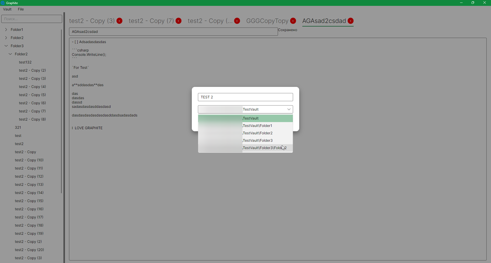
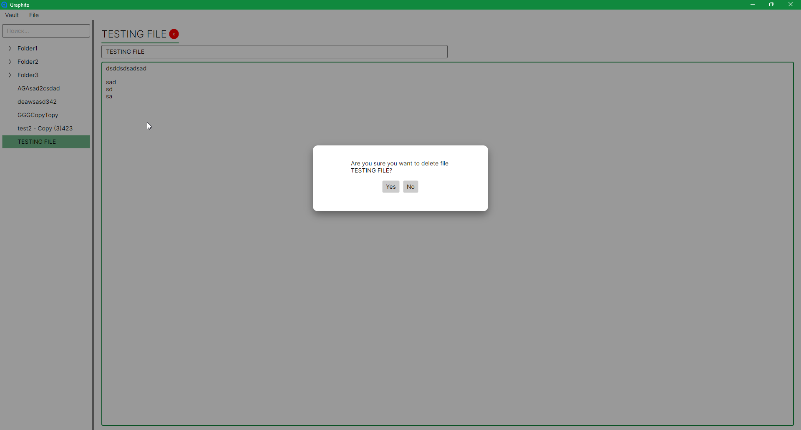
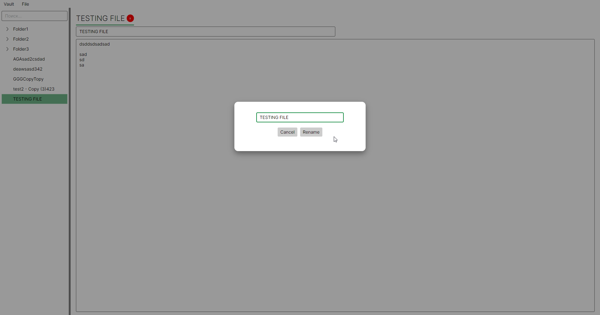

**English** | [🇷🇺 Русский](README.ru.md)

# Graphite

MVP: creating/editing notes, Markdown auto-saving, search.
v0.1 will not include: sync, server, mobile/web, plugins, MinIO, authentication.

This project was created for learning purposes and is open to your suggestions.
It will be open source forever.

One of the reasons is that I got tired of Electron-based apps consuming 400 MB–1 GB of RAM on my local machine.
I want to build an application that will have many features as it grows, while consuming a reasonable 100–200 MB.

At the moment, the application uses **61 MB** of RAM.

The project is being developed manually without AI, because again, it is primarily for learning.
However, **your pull requests may involve AI**.

Design is a secondary priority.
The main focus is optimization.

### Screenshot: no vault opened yet

### Screenshot: opened vault

All features below can be triggered via:
1. The file tree
2. The top menu
3. Keyboard shortcuts

If a note is not selected in the file tree, the action applies to the currently active (open) note.

### Screenshot: create file (Ctrl + N)

### Screenshot: delete file (Delete)
The file is moved to a temporary folder (`.trash`).

### Screenshot: rename file (F2)
