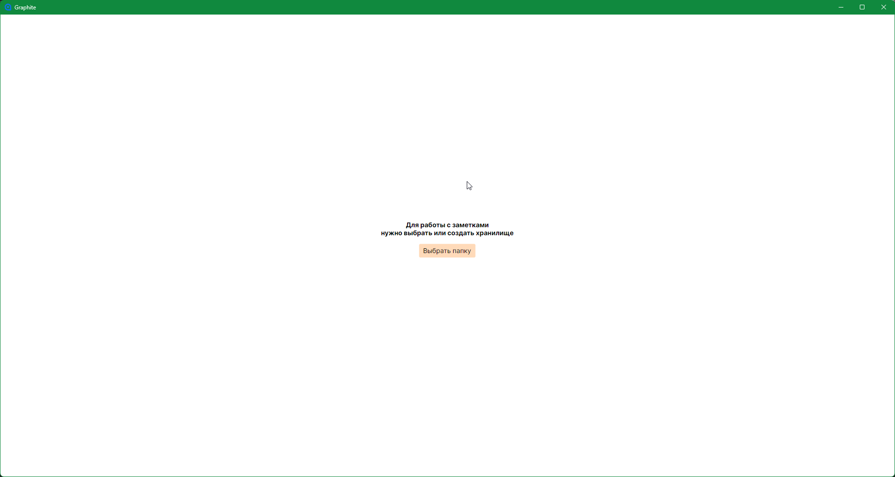
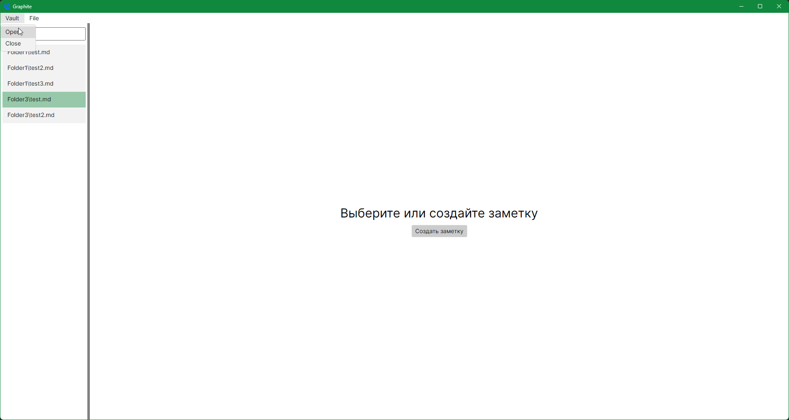

MVP: создание/редактирование заметки, автосохранение Markdown, поиск.
В v0.1 не будет: sync, сервер, mobile/web, плагины, MinIO, авторизация.

Проект создан для обучения + открыт к вашим предложениям.
Это будет opensource навсегда.

Проект делается в ручном режиме без ИИ. Так как напоминаю в первую очередь он для изучения.
Но **в ваших pull request может быть ИИ**. 

Только **пожалуйста ПОМЕЧАЙТЕ ЭТОТ PULL REQUEST ТЕГОМ *[AI]* и создавайте тесты**.

### Скрин пока хранилище еще не открыто

### Скрин открытого хранилища
